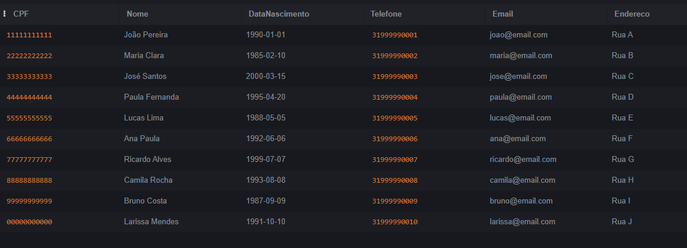
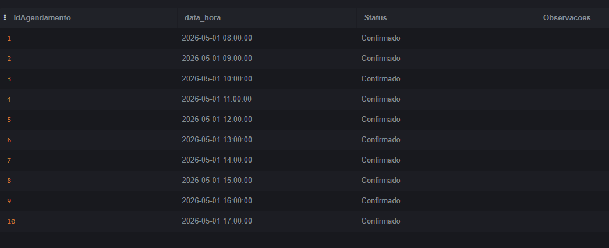
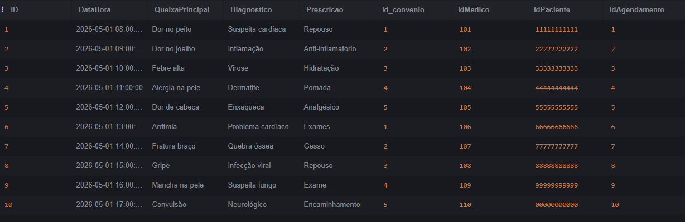
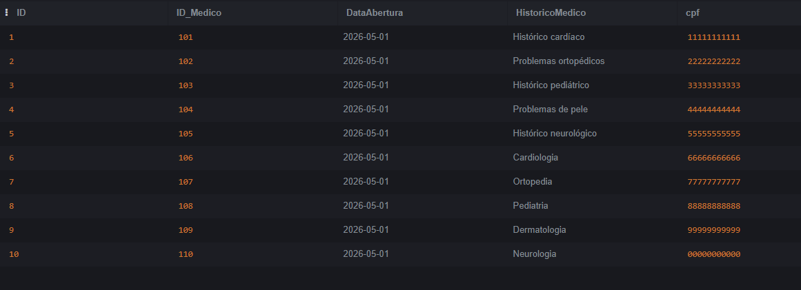
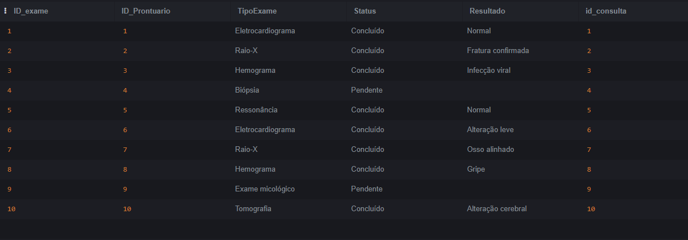

CREATE TABLE Especialidade (
    CodigoEspecialidade INT PRIMARY KEY,
    NomeEspecialidade VARCHAR(100) NOT NULL
);

INSERT INTO Especialidade VALUES
(1,'Cardiologia'),
(2,'Ortopedia'),
(3,'Pediatria'),
(4,'Dermatologia'),
(5,'Neurologia');
---------------

---------------

CREATE TABLE Medico (
    CRM INT PRIMARY KEY,
    Nome VARCHAR(100) NOT NULL,
    Idade INT,
    CodigoEspecialidade INT,
    CONSTRAINT fk_medico_especialidade
        FOREIGN KEY (CodigoEspecialidade)
        REFERENCES Especialidade(CodigoEspecialidade)
);

INSERT INTO Medico VALUES
(101,'Dr. Carlos Silva',45,1),
(102,'Dra. Ana Souza',39,2),
(103,'Dr. Pedro Lima',50,3),
(104,'Dra. Julia Alves',42,4),
(105,'Dr. Marcos Paulo',55,5),
(106,'Dra. Fernanda Rocha',37,1),
(107,'Dr. Renato Dias',48,2),
(108,'Dra. Carla Mendes',41,3),
(109,'Dr. Fabio Costa',46,4),
(110,'Dra. Patricia Gomes',44,5);
------------------

------------------
CREATE TABLE Paciente (
    CPF VARCHAR(14) PRIMARY KEY,
    Nome VARCHAR(100) NOT NULL,
    DataNascimento DATE,
    Telefone VARCHAR(20),
    Email VARCHAR(100),
    Endereco VARCHAR(200)
);

INSERT INTO Paciente VALUES
('11111111111','João Pereira','1990-01-01','31999990001','joao@email.com','Rua A'),
('22222222222','Maria Clara','1985-02-10','31999990002','maria@email.com','Rua B'),
('33333333333','José Santos','2000-03-15','31999990003','jose@email.com','Rua C'),
('44444444444','Paula Fernanda','1995-04-20','31999990004','paula@email.com','Rua D'),
('55555555555','Lucas Lima','1988-05-05','31999990005','lucas@email.com','Rua E'),
('66666666666','Ana Paula','1992-06-06','31999990006','ana@email.com','Rua F'),
('77777777777','Ricardo Alves','1999-07-07','31999990007','ricardo@email.com','Rua G'),
('88888888888','Camila Rocha','1993-08-08','31999990008','camila@email.com','Rua H'),
('99999999999','Bruno Costa','1987-09-09','31999990009','bruno@email.com','Rua I'),
('00000000000','Larissa Mendes','1991-10-10','31999990010','larissa@email.com','Rua J');
---------------

---------------
CREATE TABLE Convenio (
    id_convenio INT PRIMARY KEY,
    Nome VARCHAR(100) NOT NULL,
    Plano VARCHAR(100),
    Contato VARCHAR(100)
);

INSERT INTO Convenio VALUES
(1,'Unimed','Premium','3130000001'),
(2,'Unimed','Basico','3130000002'),
(3,'SulAmerica','Ouro','3130000003'),
(4,'Bradesco','Top','3130000004'),
(5,'Amil','Essencial','3130000005');
---------------

---------------
CREATE TABLE Agendamento (
    idAgendamento INT PRIMARY KEY,
    data_hora TIMESTAMP NOT NULL,
    Status VARCHAR(50),
    Observacoes TEXT
);

INSERT INTO Agendamento VALUES
(1,'2026-05-01 08:00:00','Confirmado',''),
(2,'2026-05-01 09:00:00','Confirmado',''),
(3,'2026-05-01 10:00:00','Confirmado',''),
(4,'2026-05-01 11:00:00','Confirmado',''),
(5,'2026-05-01 12:00:00','Confirmado',''),
(6,'2026-05-01 13:00:00','Confirmado',''),
(7,'2026-05-01 14:00:00','Confirmado',''),
(8,'2026-05-01 15:00:00','Confirmado',''),
(9,'2026-05-01 16:00:00','Confirmado',''),
(10,'2026-05-01 17:00:00','Confirmado','');
---------------

---------------
CREATE TABLE Consulta (
    ID INT PRIMARY KEY,
    DataHora TIMESTAMP NOT NULL,
    QueixaPrincipal TEXT,
    Diagnostico TEXT,
    Prescricao TEXT,

    id_convenio INT,
    idMedico INT,
    idPaciente VARCHAR(14),
    idAgendamento INT,

    CONSTRAINT fk_consulta_convenio
        FOREIGN KEY (id_convenio)
        REFERENCES Convenio(id_convenio),

    CONSTRAINT fk_consulta_medico
        FOREIGN KEY (idMedico)
        REFERENCES Medico(CRM),

    CONSTRAINT fk_consulta_paciente
        FOREIGN KEY (idPaciente)
        REFERENCES Paciente(CPF),

    CONSTRAINT fk_consulta_agendamento
        FOREIGN KEY (idAgendamento)
        REFERENCES Agendamento(idAgendamento)
);

INSERT INTO Consulta VALUES
(1,'2026-05-01 08:00:00','Dor no peito','Suspeita cardíaca','Repouso',1,101,'11111111111',1),
(2,'2026-05-01 09:00:00','Dor no joelho','Inflamação','Anti-inflamatório',2,102,'22222222222',2),
(3,'2026-05-01 10:00:00','Febre alta','Virose','Hidratação',3,103,'33333333333',3),
(4,'2026-05-01 11:00:00','Alergia na pele','Dermatite','Pomada',4,104,'44444444444',4),
(5,'2026-05-01 12:00:00','Dor de cabeça','Enxaqueca','Analgésico',5,105,'55555555555',5),
(6,'2026-05-01 13:00:00','Arritmia','Problema cardíaco','Exames',1,106,'66666666666',6),
(7,'2026-05-01 14:00:00','Fratura braço','Quebra óssea','Gesso',2,107,'77777777777',7),
(8,'2026-05-01 15:00:00','Gripe','Infecção viral','Repouso',3,108,'88888888888',8),
(9,'2026-05-01 16:00:00','Mancha na pele','Suspeita fungo','Exame',4,109,'99999999999',9),
(10,'2026-05-01 17:00:00','Convulsão','Neurológico','Encaminhamento',5,110,'00000000000',10);
----------------

----------------
CREATE TABLE Prontuario (
    ID INT PRIMARY KEY,
    ID_Medico INT,
    DataAbertura DATE,
    HistoricoMedico TEXT,
    cpf VARCHAR(14),

    CONSTRAINT fk_prontuario_medico
        FOREIGN KEY (ID_Medico)
        REFERENCES Medico(CRM),

    CONSTRAINT fk_prontuario_paciente
        FOREIGN KEY (cpf)
        REFERENCES Paciente(CPF)
);

INSERT INTO Prontuario VALUES
(1,101,'2026-05-01','Histórico cardíaco','11111111111'),
(2,102,'2026-05-01','Problemas ortopédicos','22222222222'),
(3,103,'2026-05-01','Histórico pediátrico','33333333333'),
(4,104,'2026-05-01','Problemas de pele','44444444444'),
(5,105,'2026-05-01','Histórico neurológico','55555555555'),
(6,106,'2026-05-01','Cardiologia','66666666666'),
(7,107,'2026-05-01','Ortopedia','77777777777'),
(8,108,'2026-05-01','Pediatria','88888888888'),
(9,109,'2026-05-01','Dermatologia','99999999999'),
(10,110,'2026-05-01','Neurologia','00000000000');
---------------

---------------

CREATE TABLE Exame (
    ID_exame INT PRIMARY KEY,
    ID_Prontuario INT,
    TipoExame VARCHAR(100),
    Status VARCHAR(50),
    Resultado TEXT,
    id_consulta INT,

    CONSTRAINT fk_exame_prontuario
        FOREIGN KEY (ID_Prontuario)
        REFERENCES Prontuario(ID),

    CONSTRAINT fk_exame_consulta
        FOREIGN KEY (id_consulta)
        REFERENCES Consulta(ID)
);

INSERT INTO Exame VALUES
(1,1,'Eletrocardiograma','Concluído','Normal',1),
(2,2,'Raio-X','Concluído','Fratura confirmada',2),
(3,3,'Hemograma','Concluído','Infecção viral',3),
(4,4,'Biópsia','Pendente','',4),
(5,5,'Ressonância','Concluído','Normal',5),
(6,6,'Eletrocardiograma','Concluído','Alteração leve',6),
(7,7,'Raio-X','Concluído','Osso alinhado',7),
(8,8,'Hemograma','Concluído','Gripe',8),
(9,9,'Exame micológico','Pendente','',9),
(10,10,'Tomografia','Concluído','Alteração cerebral',10);

